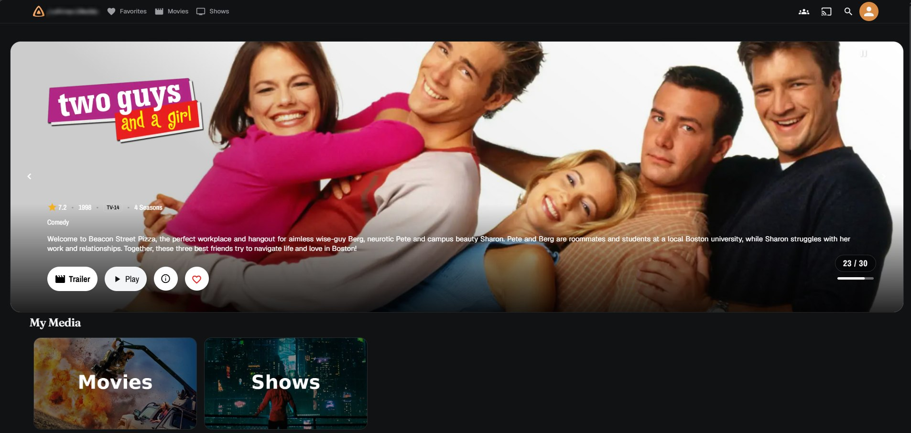
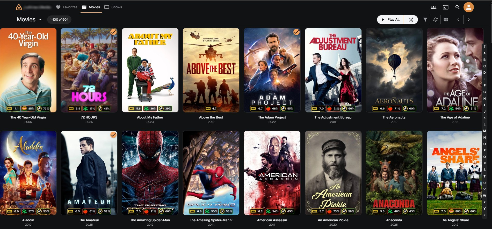
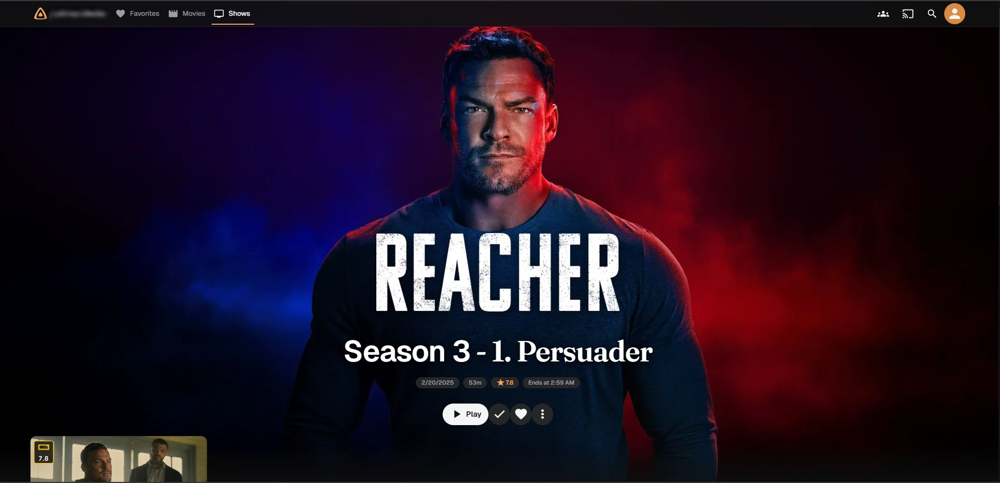
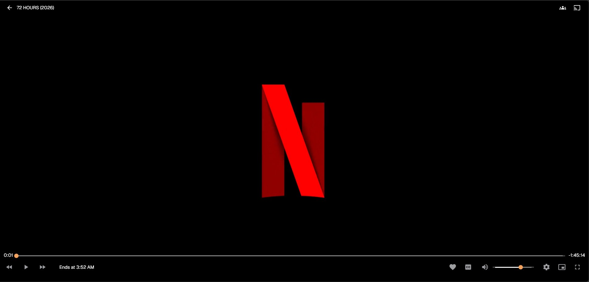

# Harbor for Jellyfin

A Jellyfin 12 theme that looks like DebridPlayer: charcoal surfaces, an amber accent, Fraunces headings, light pill buttons and lifted poster cards.

**Author:** [luttman](https://github.com/luttman)

---

## Features

- DebridPlayer palette: `#111213` page, `#1a1c1d` cards, amber `#f4a25c` accent
- Fraunces for titles, Geist for everything else
- Poster cards that grow as a whole on hover, small play button bottom-left
- Full-screen hero on item pages with a centred title block and a clear logo above it; scroll down for the details
- Media Bar plugin laid out as a rounded card
- Video player without a header overlay: only the title and buttons remain
- Round cast avatars, pill-shaped metadata and Play button
- No page backdrop on Home, Movies and Shows
- Own amber logo in the top bar

## Install

Dashboard → General → Custom CSS code:

```css
@import url("https://cdn.jsdelivr.net/gh/luttman/harbor-jellyfin@main/Theme/harbor-jf12.css");
```

Hard-refresh the web client (Ctrl+F5). jsDelivr caches `@main` for up to 12 hours; pin a commit hash to update at once. Do not import ElegantFin at the same time: the two themes style the same elements.

## Screenshots

<table>
  <tr>
    <td align="center"><br><strong>Home</strong></td>
    <td align="center"><br><strong>Movies library</strong></td>
  </tr>
  <tr>
    <td align="center"><br><strong>Item page</strong></td>
    <td align="center"><br><strong>Web player</strong></td>
  </tr>
</table>

## Customise

All colours are variables at the top of `Theme/harbor-jf12.css` (`--h-brand`, `--h-bg`, `--h-card` …). The `--jf-palette-*` block maps them onto Jellyfin 12's MUI components.

## Credits

Selectors for Jellyfin 12 were checked against [ElegantFin JF12](https://github.com/mihaif7/elegantfin-jf12), and the card and Media Bar layout follows [ElegantFin](https://github.com/lscambo13/ElegantFin).
